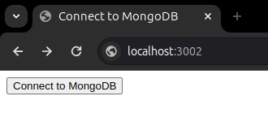
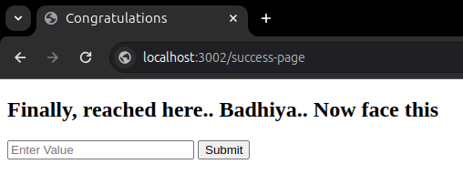
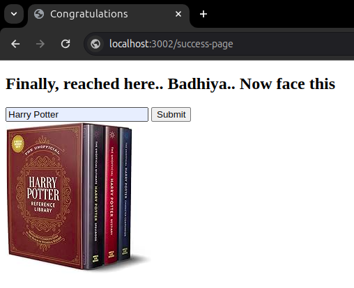

# Welcome to Fix the Bug Challenge!!

## Overview
Jcube is trying to make a simple web-application, which allows him to see the image of the products he has in his database. This involves connecting to his database, and then searching for the product. Ideally, he should be able to connect to his database, then he should be able to enter the name of the product, and the image of the product should appear on the page. But life is not so simple. He tried to code the thing up, but, as expected, got various errors.
He, then went to a Lambda Head to ask for help. Obviously, the Lambda Head found all the errors he made, and provided him a list of all the bugs in his project. Here's what he got:

## Important Information

### Initialization:
To get started, open your terminal in the root directory of the project. And install the dependencies, and get started with the bug solving. All the best!
```
$ npm install
$ node app.js
```

### Populate the .env file:
Create a .env file in the root directory of the folder, fill the following variable in the file
```cpp
MONGODB_KEY="mongodb+srv://jcube:<password>@product-db.h86x1ox.mongodb.net/?retryWrites=true&w=majority&appName=Product-DB"
```

The password would be provided to you.

### Information regarding the database:
There is a cluster hosted in the MongoDB Atlas. The database name is "eshop-database". It contains a collection called "products". One of the product is named "Harry Potter". After solving the bugs, you should be able to see it's image. The schema is provided in the codebase itself.

## Bug List
### Bug 1:
First and foremost, as soon as he starts his project starts up, he sees a "Cannot GET /" message. He had already made an HTML file for "/". He must solve this bug, so that he can see the option to Connect to his MongoDB Database.
Here's what the expected outcome looks like: 



<b> Note: </b> You are NOT supposed to make any new routes, or modify the existing endpoints. 

### Bug 2:
After solving the silly error, the next error is that, as soon as he clicks on the Button, ideally he should be redirected to the "/success-page" url. But nothing is happening. Your task is to make sure it automatically redirects to the "/success-page" url, 'by hook or by crook'.

### Bugs 3,4,5:
Once he is at the success-page, he sees an input field and a submit button. 



As soon as he gives any input, either some error shows up in the terminal, or if no error shows up, either it dosen't show any image, or if it shows the image, it doesn't show the image of the product he wants. He knows that there is a product called "Harry Potter", and ideally, this is the expected result. 



These comprise of the Bug No. 3,4,5.

<b> All The Best...👍🏻 </b>
